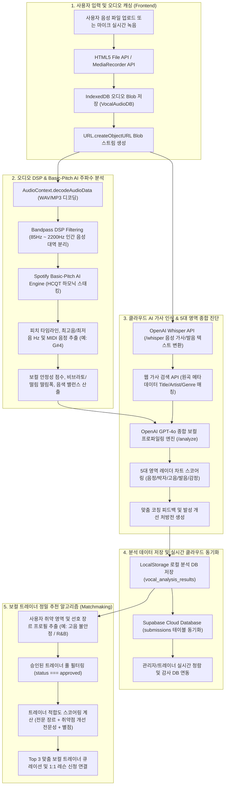
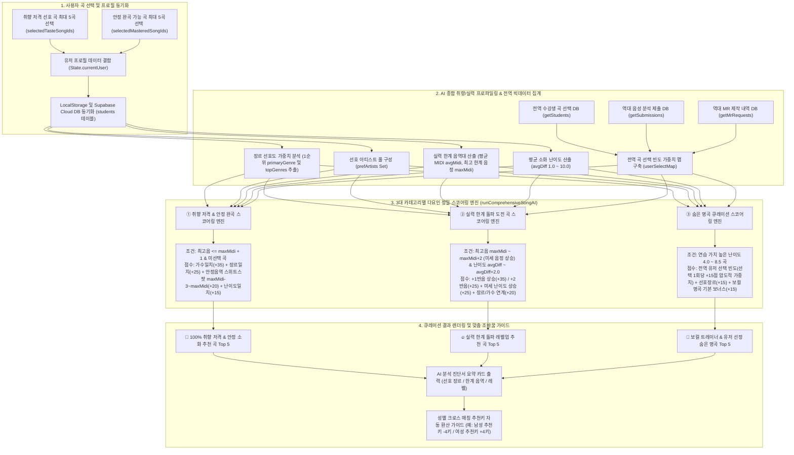
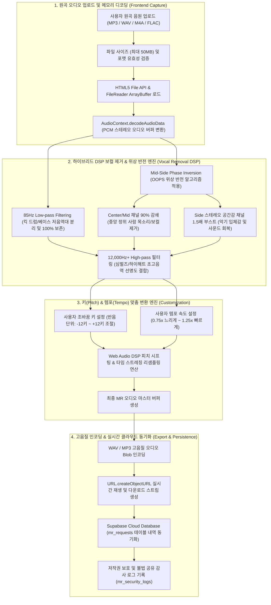

# 🔄 내일의 보컬 - 2대 핵심 서비스 데이터 흐름도 (Data Flow Architecture)

본 문서에서는 **내일의 보컬** 플랫폼에서 사용자가 경험하는 두 가지 핵심 시나리오인 **① 음성 파일 업로드부터 보컬 트레이너 추천까지의 데이터 흐름**과 **② 곡 선택부터 맞춤 곡 추천(3대 큐레이션)까지의 데이터 흐름**을 Mermaid 데이터 흐름도(DFD)와 단계별 데이터 처리 기술 명세로 상세히 정리합니다.

---

## 🎙️ 1. 음성 파일 업로드부터 보컬 트레이너 추천까지의 데이터 흐름도

사용자가 자신의 노래나 연습곡 녹음 파일을 업로드했을 때, 프론트엔드 DSP 오디오 엔진과 클라우드 AI(Whisper/GPT-4o)가 주파수와 발음을 정밀 분석하고, 그 결과를 바탕으로 사용자의 취약점을 보완해 줄 최적의 보컬 트레이너를 매칭하는 전체 데이터 흐름입니다.

### 📋 단계별 데이터 처리 명세 (Process 1)
1. **오디오 캡처 및 캐싱**: 사용자가 업로드한 오디오 파일(`File` 객체)은 브라우저 메모리 유실 방지를 위해 즉시 로컬 **IndexedDB(`VocalAudioDB`)**에 Blob 형태로 영구 보존되며, 화면 재생을 위한 비동기 스트림 URL이 생성됩니다.
2. **DSP 대역 통과 필터 및 피치 추적**: Web Audio API의 `OfflineAudioContext`를 통해 85Hz 미만의 저주파 잡음과 2200Hz 초과의 고주파 노이즈를 제거합니다. 이후 **Spotify Basic-Pitch AI 엔진**이 HCQT(Harmonic Complex Adaptive Transform) 알고리즘을 수행하여 프레임 단위 음정 변화(`timelineData`)와 최고음/최저음 음정(`G#4`, `C3` 등)을 정확히 찾아냅니다.
3. **가사 인식 및 GPT-4o 종합 진단**: 오디오 스트림은 **OpenAI Whisper API**로 전송되어 실제 발음된 가사 텍스트로 변환됩니다. 변환된 가사는 웹 검색 엔진을 통해 원곡 메타데이터와 대조되며, 최종적으로 **GPT-4o 엔진**이 프론트엔드 DSP 피치 데이터와 텍스트를 결합하여 **5대 역량 점수(음정, 박자, 고음안정성, 발음전달력, 감정표현력)**와 맞춤 처방전을 발급합니다.
4. **트레이너 적합도 스코어링 (`Trainer Matchmaking`)**: 
   $$\text{Match Score} = (\text{장르 일치도} \times 30) + (\text{취약 영역 보완 전문성} \times 30) + (\text{수강생 만족도 평균 평점} \times 8)$$
   산출된 점수를 기준으로 가장 적합한 트레이너 3명을 대시보드 및 리포트 하단에 실시간 추천합니다.

---

## 🎵 2. 곡 선택부터 맞춤 곡 추천(3대 큐레이션)까지의 데이터 흐름도

사용자가 평소 좋아하는 취향 곡과 현재 안정적으로 소화할 수 있는 완곡 목록을 선택하면, 알고리즘이 유저의 장르 선호도와 음역대 한계를 분석하고 전역 수강생들의 선택 데이터(`userSelectMap`)와 결합하여 **3대 맞춤 큐레이션(취향 저격 / 실력 한계 돌파 / 숨은 명곡)**을 생성하는 데이터 흐름입니다.

### 📋 단계별 데이터 처리 명세 (Process 2)
1. **유저 곡 선택 및 프로필 병합**: 사용자가 선택한 곡 ID 배열(`selectedTasteSongIds`, `selectedMasteredSongIds`)은 즉시 브라우저 메모리에 반영되고, 로그인 시 클라우드 **Supabase `students` 테이블**에 실시간 병합되어 크로스 PC 일관성을 유지합니다.
2. **실력 및 한계 음역대 프로파일링**: 선택된 완곡 목록(없을 경우 취향 곡 목록)의 최고 음정을 MIDI 번호로 변환하여 유저의 **한계 음역대(`maxMidi`, 예: `68` -> `G#4`)**와 **평균 완곡 난이도(`avgDiff`)**를 도출합니다. 동시에 전역 수강생들의 선택 내역, 음성 제출 내역, MR 제작 요청 내역을 순회하여 **전역 곡 선택 가중치 맵(`userSelectMap`)**을 빌드합니다.
3. **3대 알고리즘 정밀 스코어링**:
   * **취향 저격 안정소화 곡**: 유저의 최대 음역대보다 3반음 낮거나 같은 `[maxMidi - 3, maxMidi]` 구간을 **안정 소화 스위트스팟**으로 지정하여 최고 가중치(+20점)를 부여하고, 가수/장르/성별 일치도를 종합하여 부르기 편하면서도 취향에 딱 맞는 5곡을 추출합니다.
   * **실력 한계 돌파 레벨업 곡**: 기존의 무리한 고음(+4반음) 추천을 폐지하고, 현재 최고음보다 **정확히 +1~+2 반음 높거나**, 음정이 같아도 난이도가 미세하게(+0.3~+1.5) 높은 곡에 최고 점수를 부여하여 단계별 실력 향상을 이끌어냅니다.
   * **숨은 명곡 큐레이션**: `userSelectMap`에서 집계된 유저 선택 횟수에 **1회당 +15점**의 압도적 가중치를 곱하여, 실제 플랫폼 수강생들이 많이 부르고 선택한 검증된 트레이닝 명곡을 최우선으로 보여줍니다.
4. **맞춤 조바꿈 가이드 제공**: 추천된 곡의 원래 보컬 성별과 사용자의 성별이 다를 경우, 음역대 차이를 극복할 수 있는 최적의 조바꿈 키(예: `💡 남성 추천키: -4키 (-1옥타브 조절)`)를 카드 UI에 실시간 연산하여 제공합니다.

---

## 🎛️ 3. MR 스튜디오: 하이브리드 DSP 보컬 제거 및 키/템포 조절 데이터 흐름도

사용자가 원곡 음원(MP3/WAV 등)을 업로드했을 때, 프론트엔드 Web Audio API 기반의 **하이브리드 DSP 필터 및 위상 반전(Mid-Side Phase Inversion) 엔진**을 거쳐 사람 목소리만 정밀하게 감쇄하고 악기 사운드를 보존하며, 사용자의 음역대에 맞추어 실시간으로 키(Pitch)와 속도(Tempo)를 변환하는 데이터 흐름입니다.

### 📋 단계별 데이터 처리 명세 (Process 3)
1. **음원 메모리 디코딩 (`Audio Decoding`)**: 업로드된 오디오 파일은 브라우저 메모리 내에서 `ArrayBuffer`로 읽힌 뒤, Web Audio API의 `decodeAudioData`를 거쳐 고해상도 PCM 스테레오 오디오 버퍼로 변환됩니다.
2. **저음역 보존 & 위상 반전 보컬 감쇄 (`Mid-Side DSP`)**:
   * **85Hz 저음역대 보존 (`Low-pass Cutoff`)**: 킥 드럼과 베이스 기타 소리를 보호하기 위해 85Hz 이하 주파수를 분리하여 100% 원본 유지합니다.
   * **위상 반전 연산 (`Out-Of-Phase Stereo`)**: 좌(L)채널과 우(R)채널의 위상차를 계산하여 중앙(Center/Mid)에 위치한 보컬 사운드를 **90% 감쇄**시키고, 공간감을 담당하는 좌우 스테레오(Side) 채널을 **1.5배 증폭**하여 풍부한 반주를 완성합니다.
   * **12,000Hz+ 초고음역 보존**: 심벌즈와 하이해트 등의 선명한 고주파 사운드를 보호하여 타악기 리듬감을 살려냅니다.
3. **키 및 템포 리샘플링 (`Pitch & Tempo Shifting`)**: 사용자가 선택한 조바꿈 설정(반음 단위, `-12` ~ `+12`) 및 속도 설정(`0.75x` ~ `1.25x`)에 따라 DSP 리샘플링 연산이 실시간 수행되어 맞춤형 트레이닝 MR을 렌더링합니다.
4. **저작권 감사 및 클라우드 동기화 (`Security & Audit`)**: 생성된 MR 음원은 로컬 다운로드를 지원함과 동시에 클라우드 **Supabase `mr_requests` 및 `mr_security_logs` 테이블**에 이메일, 타임스탬프, 원곡 파일명이 기록되어 불법 유포 방지 및 저작권 감사 트레일을 보장합니다.

---
*본 문서에 정리된 데이터 흐름과 큐레이션·DSP 엔진은 최신 스크립트에 완벽히 구현 및 배포되어 있습니다.*
